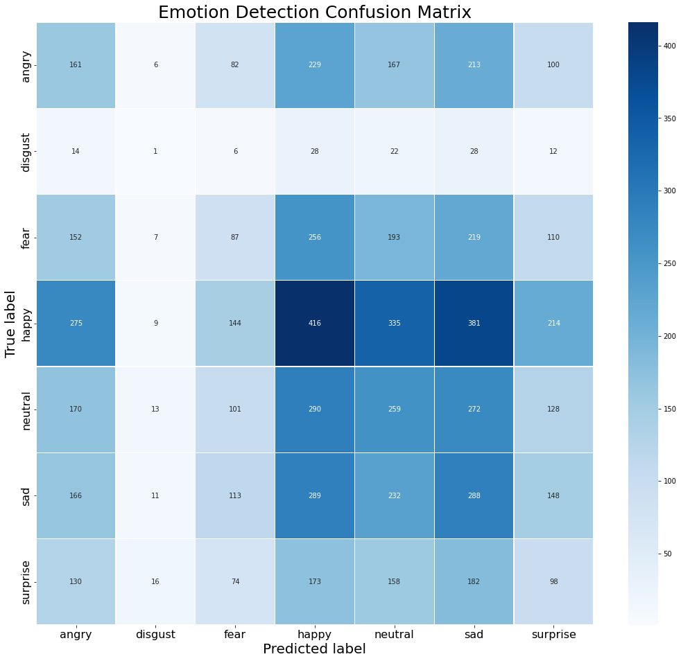

# Emotion Detection Through a Webcam

-----

### Problem Statement:

Since COVID changed the world, we are finding ourselves using online communication now more than ever.  Even though we usually have an image of ourselves (how we look on webcam) during a meeting, we often don’t pay attention to our mannerism and how we come across to others.  This project is aimed to address this by giving a positivity score.  This can be great to practice a presentation or prep for job interviews.  The dataset used to build the classification model comes from Kaggle fer2013, which was a kaggle competition in 2013 to detect 7 facial expressions.  First I built a classification model that can predict expressions on new images then built a app that can classify your expression, and output a result of how happy or sad you came across during the recording.

### Challenges And Topics to Learn:

- CNN classification model

- Image processing

- Face detection

- Streamlit

This project has several challenges.  First finding a dataset of labeled facial expression without the huge labor task of labeling downloaded images.  Next is identifying features in an image.  This has been made easier with libraries such as openCV.  Depending on the model you want to run, the image might need to be converted to grayscale or RGB.  Then training the model to recognize features in the face and determine an emotion.  Lastly is actually deploying the model to a live app where you can run video from your webcam and give a live emotion detection.  This also involved keeping track and applying a score at the end.  The score is assembled by adding positive (happy, neutral, surprise) and negative(Angry, disgust, fear, sad). 

### Dataset:

Dataset from Kaggle  [Link for data](https://www.kaggle.com/msambare/fer2013)

Train set: 28,709 images

Test set: 7,187 images

7 categories:

- Happy
- Neutral
- Sad
- Fear
- Angry
- Surprise
- Disgust

Images 48X48 grayscale of faces

dataset size:140 MB

|          | Number of Images |
|----------|------------------|
| Happy    | 8,989            |
| Neutral  | 6,198            |
| Sad      | 6,077            |
| Fear     | 5,121            |
| Angry    | 4,953            |
| Surprise | 4,002            |
| Disgust  | 547              |

The dataset is unbalanced with a disproportionately low number for disgust.  In future work if you needed to boost for a more balanced dataset you could try some data augmentation in the disgust category.  For now since we are looking for a positive or negative score we will leave the number of images as is.

### EDA

EDA was done as quick visual browsing through randome .jpg for quality of images.

### Techniques used:

I decided to use the OpenCV library to help with facial detection.  Since faces have many features to detect, OpenCV utilizes cascades which will break the face detection into multiple tests and quickly scan the image for test one and if it passes it will go on to the next test, if it fails it will no longer test for faces.  Since face detection is a common project OpenCV has many other built-in detections such as eyes and hands.
Each cascade is a bunch of XML files, and you will need a xml file from OpenCV github for the program to run.  [Link](https://github.com/opencv/opencv/tree/master/data/haarcascades)

Building in Streamlit was another challenge, but that was more from lack of experience.  If I build another app it will go a lot smoother.  It took me a while to get the webcam live and working.  I first needed a way to turn the camera on and off.  This was accomplished with a check box and while loop.  So while the box is checked the camera is on.  While the camera is on it takes the framed images and uses openCV to capture the image, convert it to grayscale,detect the face and resize so it’s appropriate for the model.  Then it’s sending the image to the model to make a prediction.  The prediction is then added to the image along with the face detection box so you can see live what the model is predicting.  While this is running a file is being updated with positive and negative expressions counts.  Once you are finished you simply uncheck the run box to end the live webcam session and view the results.  The results simply reads in the stored csv file and displays it as a dataFrame table.

I loaded the model to cache to try to improve prediction speed.  Although there is still some lag it gets the job done.

### Reults:

I was only able to get 61% accuracy on predicting facial expressions.  This is partly a result of some of these categories being hard to classify even for humans.  Some images are in the angry folder but I probably would have classified them as sad, but somebody thought that person was angry and so there will probably always be some debate on some of the images with humans giving the original classification to learn from.
I think this still has many uses and I think getting feedback on if you are giving off a positive or negative vibe can be beneficial for people and self improvement.

From the image above you can see that happy performed the best.  However overall there was a lot of confusion between emotions.

### Future work:

To improve the model you would need better or more emotion labeled data.  There is a limit on what the computer can learn when images could easily be put in other categories.  Depending on the direction of the project, you could add speech recognition and give a count of the times some used “um” or other words frowned upon in presentations.  Also you could detect other objects like hands to tell if the person is to animated...

### How to run:

If you want to replicate the conda enviornment you can use the conda_env.txt file to replicate the enviornment I used, or you can check what needs to be installed in your own environment with the requirements.txt

If you want to run this program you can fork my repo.  You can go directly to the app.py and run this file.  Make sure you have the two model files (model-2.json, model-2-w.h5) and the “haarcascade_frontalface_default.xml” file for face recognition.  To get the program to work in streamlit - in terminal go to the directory where you have the files stored and type “streamlit run app.py”  This will start the app in a local browser window.  Note if you are using an external webcam you might need to change the cap = cv2.VideoCapture(0) to a 1 or -1, 0 is the default for built in webcam on laptops.
To run the webcam, you can click the run checkbox.  While the camera is on it will record your positive and negative emotions.  When you are done you can uncheck the box to stop recording and click on the “view results” to see a summary of your results.
If you want to run through everything yourself  I did the preprocessing in jupyter notebook and the model building in googles colab.  For the data you will need to down load it from this link.  For running the actual app you can use any text editor.  I used pycharm but any are fine.
[Link for data](https://www.kaggle.com/msambare/fer2013)

If you want to run the model, I ran my model in google colab.  I uploaded the zip file of images and ran the unzip in google colab.
